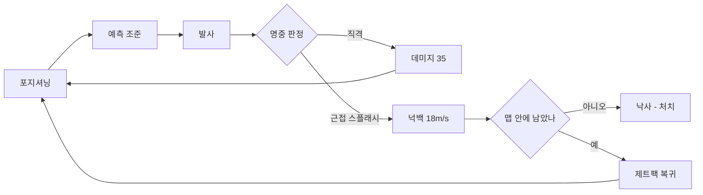

# BoomPG — 게임 디자인 문서 (GDD)

> **이 문서가 게임 내용의 정본입니다.** 현재 버전 **v0.4** (2026-09-14 반입).
> 버전은 파일명이 아니라 git 이력이 관리합니다. 개정본이 나오면 **이 경로에 덮어쓰고**
> 아래 변경 이력에 한 줄 추가하십시오. 파일을 새로 만들지 마십시오.
>
> 확정된 상위 축과 그 근거는 ADR에 있습니다. 이 문서와 ADR이 충돌하면 **ADR이 우선**입니다.
>
> | 축 | 결정 | 근거 |
> |---|---|---|
> | 플레이 형태 | 온라인 멀티 PvP | [ADR-0001](../decisions/ADR-0001-온라인-멀티-pvp.md) |
> | 플랫폼 | PC (Windows) **단독** | [ADR-0002](../decisions/ADR-0002-pc-단독-플랫폼.md) |
> | 승리 조건 | 낙사형 배틀로얄 (모드 A) | [ADR-0003](../decisions/ADR-0003-낙사형-배틀로얄-승리조건.md) |
> | 네트워크 | Photon Fusion 2 (Host Mode) | [ADR-0004](../decisions/ADR-0004-photon-fusion-2.md) |
>
> 본문 1장은 플랫폼을 "PC 우선"으로 적고 있으나, ADR-0002에 따라 **PC 단독**으로 확정되었습니다.
> 모바일·콘솔은 현재 범위 밖입니다.
>
> 아직 정해지지 않은 것은 문서 끝의 22장과 [docs/INDEX.md](../INDEX.md)의 결정 대기 목록에 있습니다.

<aside>
🎯

**v0.4 확정 사항**

엔진 **Unity 6 LTS (URP)** / 맵 **공중 정거장 스카이야드** / 기본 모드 **솔로 8인** / **직격 3방 처치**

추가: 게임 모드 3종, 캐릭터 클래스 3종, 팀전 다운 시스템, 리벤지 연출

아래 수치는 모두 프로토타입 시작값이며, 플레이테스트로 조정하는 것을 전제로 합니다.

</aside>

- 원문 기획서 (v0.1)
    
    게임 설명
    
    각 플레이어마다 RPG를 들고 있다.
    상대를 RPG를 사용해 점점 줄어드는 지형 안에서 마지막까지 살아남는 게임이다.
    
    재미요소
    
    - 친구들과 서로 경쟁하며 생존하는 것
    - 점점 줄어드는 맵과 일정량 사용 가능한 하늘을 나는 제트백으로 가까스로 맵에 착륙하는 긴장감
    - 더 좋은 RPG로 변경하는 성장 요소
    - 다양한 캐릭터 구매 요소
    
    규칙
    
    - RPG로 상대를 맞추면 치명타
    - RPG로 상대 주변을 맞추면 적은 데미지 + 멀리 넉백.
    - 제트백 일정 사용량 지정
    - 일정 시간마다 줄어드는 맵 범위

---

# PART I. 게임 개요

## 1. 개요

| 항목 | 내용 |
| --- | --- |
| 타이틀 | BoomPG (가제) |
| 장르 | **3인칭 로켓 아레나 액션 (넉백 파이터)** |
| 모드 | 배틀로얄(A) / 세컨드 찬스(B) / 3대3 거점전(C) — 10장 참고 |
| 시점 | TPS 고정 — 로켓 궤적과 자기 넉백을 눈으로 봐야 하므로 FPS보다 유리 |
| 엔진 | **Unity 6 LTS (URP)** |
| 플랫폼 | PC (Windows) 우선 |
| 인원 | 모드 A 8인 / 모드 B 무제한 / 모드 C 3대3 (10장 참고) |
| 1매치 시간 | 5분 15초 (평균 5~6분 목표) |
| 맵 | **공중 정거장 "스카이야드" 1종** |
| 타깃 | 친구와 파티 플레이하는 10~20대 캐주얼 슈터 유저 |
| 참고작 | **대난투(스매시)** — 밖으로 날려 처치하는 구조 / **로켓 아레나** — 3인칭 로켓 넉백 / **폴가이즈** — 캐주얼 톤 |
| BM | 부분 유료화 — 코스메틱 전용 (밸런스 영향 없음) |

### 원 라인 피치

> **"조준보다 밀어내기. 체력을 깎는 게 아니라 하늘 밖으로 날려버리는 로켓 아레나."**
> 

<aside>
🧭

**왜 "배틀로얄"이 아닌가**

배틀로얄을 규정하는 것은 축소되는 맵이 아니라 **파밍**입니다. 빈손으로 떨어져 무기를 줍고 그 장비 격차로 싸우는 구조죠. 이 게임은 전원이 동일한 RPG로 시작하고, 160m 맵에 8인, 5분 매치입니다 — 파밍 구조가 없으므로 **축소 링이 있는 아레나**가 정확합니다.

따라서 배틀로얄은 장르가 아니라 **모드 중 하나**로 둡니다. 그래야 모드 B(목숨 2개)와 모드 C(3대3 거점)가 곁가지가 아니라 같은 코어 위에 올린 대등한 변주로 읽힙니다.

</aside>

<aside>
⚠️

**선례 확인 필요 — Rocket Arena (EA, 2020)**

체력 대신 넉백 게이지가 차고 아레나 밖으로 날아가면 아웃되는 3대3 슈터로, 컴셉이 상당히 유사했고 상업적으로는 부진했습니다. **이 서술은 검색 없이 작성된 것이므로 반드시 직접 확인하세요.**

실패 원인을 짚어두면 차별점을 명확히 잡는 데 도움이 되고, 포트폴리오 발표에서 "유사 선례를 알고 있느냐"는 질문에 대답할 거리가 생깁니다.

</aside>

## 2. 핵심 재미 (Core Pillars)

기획의 모든 결정은 아래 3개 기둥 중 하나를 강화해야 합니다.

### P1. 킬보다 "낙사"가 주력이다

직격도 3방을 맞춰야 죽습니다. 데미지로 죽이는 건 느리고, **넉백으로 밀어 떨어뜨리는 것이 압도적으로 빠릅니다.**

<aside>
⚠️

**직격 3방 결정의 파급 효과**

TTK(처치 소요 시간)가 길어진 만큼 데미지 경쟁의 비중이 줄고 낙사 비중이 커집니다. 이건 P1을 강화하므로 의도한 방향입니다. 다만 매치가 늘어지지 않도록 **맵 축소 스케줄을 조였고**, 로켓 점프가 상대적으로 싸지므로 **자가 데미지 비율을 50%로 올렸습니다.**

</aside>

목표 지표: 전체 처치 중 **낙사 비율 60~70%**

### P2. 제트팩은 구원이자 족쇄

연료가 4초뿐이라, 밀려났을 때 "지금 쓸까 아껴둘까"의 판단이 매 순간 발생합니다. 아슬아슬하게 복귀하는 순간이 이 게임의 가장 큰 쾌감 지점입니다.

### P3. 좁아지는 맵 = 강제 교전

발판 자체가 무너져 사라지므로, 후반에는 조준 없이도 서로를 날려버리게 됩니다.

## 3. 게임 루프

### 3.1 매치 루프 (초 단위)



### 3.2 세션 루프 (매치 단위)

`로비 → 모드·클래스 선택 → 매칭 → 투입 → 교전/생존 → 결과 화면 → 재화·경험치 → 로비`

### 3.3 메타 루프 (계정 단위)

`매치 플레이 → 코인/경험치 → 캐릭터·RPG 스킨 해금 → 새 룩으로 다시 플레이`

---

# PART II. 코어 플레이

## 4. 조작 (PC 기준)

| 입력 | 동작 |
| --- | --- |
| W A S D | 이동 |
| Space | 점프 |
| Space 홀드 (공중) | 제트팩 상승 |
| 마우스 좌클릭 | RPG 발사 |
| 마우스 우클릭 | 견착 조준 (FOV 축소 + 궤적 가이드 표시) |
| R | 재장전 |
| **Shift** | **클래스 스킬** (대시 / 예비탄 / 갈고리 — 클래스별 상이) |
| Q | 특수 탄두 사용 (필드에서 주웠을 때만 활성화) |
| F | 치료제 총 (**팀전 전용**, 인당 1개, 재사용 불가, 자가 치료 불가) |
| Tab | 생존자/순위 확인 |

## 5. 캐릭터 & 클래스

### 5.1 공통 기본 스펙

- 체력(HP): **100** — 자동 재생 없음
- 이동 속도: **6.0 m/s**
- 점프 높이: **1.8 m**
- 공중 조작력: 지상 대비 **40%**
- 캐릭터 캡슐: 반경 0.4 m / 높이 1.8 m

<aside>
⚖️

**밸런스 원칙**

위 기본 스펙은 **전 클래스 100% 동일**합니다. 클래스 간 차이는 **Shift 스킬 단 하나뿐**이며, 체력·속도·무기 성능은 전혀 다르지 않습니다.

코스메틱(13장)은 이 스킬에도 영향을 주지 않습니다 — 외형·보이스·이펙트만 바뀝니다.

</aside>

### 5.2 클래스 3종 — 카운터 삼각관계

**스피드 → 공격 → 기술 → 스피드** 로 물고 물리는 구조입니다.

#### ① 스피드 — 대시

| 항목 | 값 |
| --- | --- |
| 효과 | 즉시 6m 돌진, 시전 0.15초 |
| 저항 프레임 | 돌진 중 0.2초간 **모든 강제 이동(넉백 + 견인) 50% 감소**. 직격 데미지는 그대로 |
| 쿨다운 | 3.5초 |
| 공중 사용 | 가능 (1회) — 약한 공중 조작력을 보완 |

의도: 날아오는 로켓 회피용. 저항 프레임이 견인에도 적용되므로 갈고리에 걸려도 끌려오는 거리가 절반으로 줄어 탈출 여지가 남습니다.

#### ② 공격 — 예비탄

| 항목 | 값 |
| --- | --- |
| 효과 | 재장전 무시하고 보조 로켓 1발 즉시 발사 |
| 위력 | 기본의 70%, 탄속 35 m/s (더 빠름) |
| 쿨다운 | 8초 |

의도: 첫 발이 빗나가거나 상대가 대시로 회피한 직후, 착지 지점을 즉각 저격하는 마무리 용도.

#### ③ 기술 — 갈고리

| 항목 | 값 |
| --- | --- |
| 사거리 | 12m |
| 판정 지연 | 명중 후 견인 시작까지 0.3초 (즉발 아님 — 이 틈에 예비탄으로 끊길 수 있음) |
| 견인 속도 | 20 m/s |
| 쿨다운 | 6초 |
| 대상 | **적/아군 구분 없이 적용** (다운 상태 포함) |

<aside>
🪝

**용도를 제한하지 않는 범용 견인 도구입니다.** 고정된 역할을 부여하지 않고, 플레이어가 스스로 활용법을 찾는 확장성 있는 도구로 설계합니다.

- 적을 끌어당겨 사거리 안으로 강제 진입 (근접전 유도)
- 적을 절벽 쪽으로 끌어당겨 낙사 직전 상황 만들기
- 자기 자신을 지형에 걸어 이동/탈출
- 다운된 아군을 안전지대로 끌어와 대피시키기 (11장)
- 환경 오브젝트를 끌어와 즉석 엄폐물 만들기
</aside>

### 5.3 카운터 관계 근거

| 관계 | 이유 |
| --- | --- |
| 스피드 → 공격 | 예비탄도 결국 조준이 필요한데, 대시의 짧은 저항 프레임 안에 들어오면 타이밍 계산이 어긋남 |
| 공격 → 기술 | 갈고리는 0.3초 판정 지연이 있어 시전 자세가 사실상 무방비 — 그 사이 예비탄을 꽂으면 견인 시작 전에 끊김 |
| 기술 → 스피드 | 갈고리 사거리(12m)가 대시(6m)보다 길어 도망 경로를 끊고 원하는 위치로 끌어올 수 있음. 단, 대시 저항 프레임이 견인에도 적용되므로 확정 우위는 아님 |

## 6. 전투 시스템

### 6.1 RPG 기본 스펙 (Mk.I)

| 항목 | 값 | 설계 의도 |
| --- | --- | --- |
| 탄속 | 28 m/s | 느려서 **예측샷 필수** → 실력 차이 발생 |
| 재장전 | 2.2초 | 한 발의 무게감. 빗나가면 확실한 처벌 |
| 장탄 | 1발 / 예비탄 무제한 | 탄 관리 스트레스 제거 (캐주얼 톤) |
| 폭발 반경 | 4.5 m | 캐릭터 폭의 약 5배 → 스플래시가 주력 |
| 중력 배율 | 0.35 | 원거리는 포물선 계산 필요 |

### 6.2 데미지 & 넉백 테이블

폭심으로부터의 거리에 따라 선형 감쇠합니다.

| 거리 | 데미지 | 넉백 속도 | 처치 소요 |
| --- | --- | --- | --- |
| **직격 (Direct Hit)** | 35 | 14 m/s | **3방** |
| 0.0 ~ 1.0 m | 20 | **18 m/s** | 5방 |
| 1.0 ~ 2.5 m | 12 | 13 m/s | 9방 |
| 2.5 ~ 4.0 m | 6 | 8 m/s | 17방 |
| 4.0 ~ 4.5 m | 3 | 4 m/s | 34방 |

<aside>
💡

**핵심 설계 포인트**

직격은 데미지가 높고, 근접 스플래시는 **넉백이 높습니다.**

즉 "죽일까(직격 조준), 떨어뜨릴까(발밑 조준)"의 선택이 매 발사마다 발생합니다. 이 트레이드오프가 P1의 핵심 장치입니다.

</aside>

**넉백 방향 계산**

```csharp
Vector3 dir = (targetPos - explosionPos).normalized;
dir.y = Mathf.Max(dir.y, 0.35f);          // 항상 살짝 띄워서 미끄러지듯 밀림
Vector3 knockback = dir.normalized * speedByDistance;
```

### 6.3 로켓 점프 (자가 넉백)

상급자 기동 테크닉이자, 이 게임의 스킬 천장(skill ceiling)입니다.

- 자가 데미지: 스플래시 데미지의 **50%** (최대 10)
- 자가 넉백: **100%** 적용
- 최대 도달 높이: 약 6.5 m (수직 발사 기준)

체력을 대가로 제트팩 연료를 아끼고 이동하는 선택지를 만듭니다. 3방 킬 체제에서는 HP 10의 가치가 낮아지므로, 남발이 관측되면 자가 데미지를 60~65%까지 올립니다.

### 6.4 처치 판정 & 킬 크레딧

| 사망 원인 | 킬 크레딧 |
| --- | --- |
| HP 0 | 마지막 데미지를 가한 플레이어 |
| **맵 밖 낙하** (`Y < -20`) | **최근 5초 내 마지막으로 넉백을 가한 플레이어** |
| 축소 구역 데미지 사망 | 없음 (자멸 처리) |
| 자가 로켓 점프로 낙사 | 자살 처리 |

<aside>
🔑

**5초 크레딧 룰은 필수입니다.** 이게 없으면 "밀어냈는데 킬이 안 뜨는" 상황이 게임의 주 처치 수단에서 계속 발생합니다.

</aside>

## 7. 제트팩 시스템

- 최대 연료: **100**
- 소모 속도: **25/초** → 최대 **4초** 연속 비행
- 상승 속도: 6.5 m/s
- 공중 수평 이동: 4.0 m/s
- 회복 조건: 지면 착지 후 **1.5초 대기** → 20/초 회복 (완충까지 약 6.5초)
- 피격 시: **즉시 1.0초 사용 불가**

**설계 의도**

- 4초라는 짧은 시간 → "지금 쓸까?"라는 판단이 매번 발생 (P2)
- 피격 잠금 → 넉백당한 직후 바로 복귀하지 못하는 **떨어지는 공포의 1초**를 만듦
- 착지 딜레이 → 도망만 다니는 플레이 방지

**HUD:** 화면 하단 좌측 연료 게이지. 30% 이하 시 붉은 점멸 + 경고음 + 제트팩 사운드 피치 하강.

---

# PART III. 맵 & 매치 진행

## 8. 맵 설계 — 공중 정거장 "스카이야드 (Sky Yard)"

### 8.1 콘셉트

구름 위에 떠 있는 낡은 화물 정거장. 난간은 거의 없고, 가장자리 아래는 **구름뿐 = 무한 낙하**.

- 전체 크기: **160 m × 160 m** (초기 유효 반경 80 m)
- 낙사 지대 비율: 전체 면적의 **40% 이상** ← P1 달성의 핵심 조건

### 8.2 구역 구성

| 구역 | 고도 | 특징 | 배치물 |
| --- | --- | --- | --- |
| **중앙 관제탑** | +18 m | 시야 최상 / 낙사 위험 최고. 발판 폭 4~6 m | 특수 탄두 스폰 (하이리스크 하이리턴) |
| **도킹 암 ×4** | +8 m | 십자 배치. 폭 6 m 다리로 중앙과 연결. 주 전장 | 강화 칩 2개 |
| **위성 플랫폼 ×4** | +8 m | 모서리. 초기 스폰 지점. 서로 15 m 간격 (제트팩 도달 가능) | 강화 칩 1개, 회복 아이템 |
| **화물 야드** | 0 m | 넓은 지면. 안전하지만 위에서 계속 얻어맞음 | 회복 아이템 다수 |
| **킬존** | −20 m | 구름층. 진입 시 즉사 | — |

### 8.3 모드별 스폰 배치

| 모드 | 스폰 방식 |
| --- | --- |
| A. 배틀로얄 (8인) | 위성 플랫폼 4개 × 2인. 서로 마주보지 않도록 45° 오프셋. 투입 후 15초 무적 |
| B. 세컨드 찬스 (무제한) | 하늘 발판에서 자유 낙하 투입. 인원수만큼 동적 스폰 지점 생성 |
| C. 3대3 거점전 | 위성 플랫폼 4개 중 2개씩 묶어 팀별 스폰존으로 재배정 (**2진영 대치 레이아웃 별도 필요**) |

### 8.4 레벨 디자인 체크리스트

- [ ]  완전 엄폐물 금지 — 모든 엄폐물은 높이 1.2 m 이하 **또는** 폭 3 m 이하 (스플래시로 우회 가능해야 함)
- [ ]  사방이 벽인 밀폐 실내 금지 (넉백이 무의미해짐)
- [ ]  낙사 위험 없는 평지가 30 m 이상 연속되지 않을 것
- [ ]  모든 지점에 최소 2방향 진입로
- [ ]  모든 발판 가장자리에서 15 m 이내에 착지 가능한 다른 발판 (제트팩 4초 = 약 16 m 수평 이동)
- [ ]  한 명이 지키면 아무도 못 뚫는 좁은 통로 금지

## 9. 맵 축소 (Collapse)

### 9.1 페이즈 스케줄 (8인 기준, 총 5분 15초)

| 페이즈 | 대기 | 축소 | 축소 후 반경 | 초당 데미지 |
| --- | --- | --- | --- | --- |
| 0 (투입) | 0:15 | — | 80 m | — |
| 1 | 0:50 | 0:25 | 60 m | 2 |
| 2 | 0:45 | 0:20 | 44 m | 3 |
| 3 | 0:35 | 0:20 | 30 m | 5 |
| 4 | 0:30 | 0:15 | 18 m | 8 |
| 5 | 0:20 | 0:15 | 8 m | 12 |
| 6 (최종) | 0:15 | 0:10 | 3 m | 20 |

### 9.2 축소 연출 — 무너지는 정거장

자기장 원이 아니라, **바깥쪽 정거장 모듈이 실제로 분리되어 떨어져 나가는 방식**입니다.

1. **예고 (5초 전)** — 해당 구역 바닥에 붉은 경고 라인 + 경보음 + 패널 진동
2. **분리** — 도킹 클램프가 풀리며 모듈이 기울어짐 (1.5초)
3. **낙하** — 모듈이 구름 아래로 떨어지며 소멸
4. 그 위에 서 있던 플레이어는 **떨어지면서 제트팩으로 탈출해야 함**

<aside>
🔗

이 연출이 P2(제트팩)와 P3(축소맵)를 하나로 묶어줍니다. **"발판이 사라지는 순간 = 제트팩을 써야 하는 순간"**

</aside>

## 10. 게임 모드

### 10.1 모드 A — 배틀로얄 (기본)

솔로 8인, 목숨 1개, 9장 축소 스케줄 그대로. 이 문서의 모든 기본 수치는 이 모드를 기준으로 합니다.

### 10.2 모드 B — 세컨드 찬스 (Second Chance)

닌텐도 대난투의 "목숨 2개" + 오버워치 리벤지 연출을 결합한 솔로 모드입니다.

| 항목 | 내용 |
| --- | --- |
| 인원 | **무제한** (하늘 발판에서 자유 낙하로 투입) |
| 목숨 | 2개 |
| 1차 사망 | 리벤지 연출(15장) 발동 → 3초 후 맵 랜덤 지점 리스폰, 2초 무적 |
| 복수 마커 | 리스폰 즉시 HUD에 킬러 방향을 가리키는 화살표 표시 (정확한 좌표 아님) |
| 복수 성공 | 그 킬러를 처치/낙사시키면 결과 화면에 "복수 달성" 별도 표기 |
| 마커 해제 | 킬러가 다른 사람에게 먼저 죽으면 자동 해제 + 알림 |
| 2차 사망 | 완전 탈락, 부활 없음 |

<aside>
⚠️

**인원 상한**: "무제한"은 기획 의도이며, 실제 구현 상한선은 M2 단계에서 Photon Fusion 2 Host Mode의 실측 한계를 확인한 뒤 결정합니다 (22장). 인원이 늘어나면 9.1 축소 스케줄의 초기 반경(80m)도 인원수에 비례해 동적으로 넓히는 규칙이 필요합니다.

</aside>

### 10.3 모드 C — 3대3 거점전 (관제탑 점령)

스카이야드의 **중앙 관제탑(+18m)**을 그대로 거점으로 재활용하는 팀전입니다.

| 항목 | 내용 |
| --- | --- |
| 인원 | 3 vs 3 |
| 승리 조건 | 관제탑 점령 시간 누적 점수 (또는 팀 전멸) |
| 아군 데미지 | **없음** — 단, 아군 넉백은 그대로 적용됨 |
| 다운 시스템 | 적용 (11장) |

<aside>
😂

**아군 넉백에 의한 낙사는 의도된 재미 요소입니다.** 데미지는 안 들어가지만 실수로 아군을 절벽 밖으로 밀어버릴 수 있습니다. 결과 화면에 이런 사고를 **"팀킬 낙사"**로 별도 표기하고, 문구는 "너무 열심히 밀었다" 식으로 코믹하게 처리합니다. 16장의 "죽어도 웃긴" 톤과 정확히 같은 결입니다.

</aside>

## 11. 다운 시스템 (팀전 전용)

HP가 0이 되면 즉시 탈락이 아니라 **다운(Down) 상태**로 전환됩니다.

| 항목 | 내용 |
| --- | --- |
| 발동 조건 | HP 데미지로 쓰러졌을 때만. **넉백으로 맵 밖에 떨어지면 다운 없이 즉시 탈락** (P1 유지) |
| 제한시간 | **20초** — 초과 시 자동 탈락 |
| 상태 중 넉백 | 다운 상태에서도 넉백 판정 적용 — 스플래시에 맞아 절벽 밖으로 밀리면 낙사 처리 |
| 시야/조작 | 시점이 낮아지고 조준 불가. 느리게 기어다니는 이동만 가능 |
| 구조 ① 치료 | 치료제 총(F 키, **별도 무기 슬롯**, 인당 1개, 자가 치료 불가)으로 다운된 아군을 조준해 명중시켜야 함 |
| 구조 ② 대피 | 갈고리(5.2)로 다운된 아군을 안전지대로 견인 (회복은 아니고 위치 이동 전용) |
| 마무리 처형 | 적이 다운된 상대에게 근접하면 확정 처치 — **"발로 차서 절벽 밖으로 밀어버리는" 코믹 연출** (그로테스크 지양, P1과 자연 연결) |

---

# PART IV. 성장 & 메타

## 12. 인게임 성장 요소

### 12.1 RPG 등급

매치 시작 시 전원 Mk.I. **필드의 강화 칩을 먹거나, 적을 처치해 상대 보유분을 흡수**합니다.

| 등급 | 필요 칩 | 변화 |
| --- | --- | --- |
| Mk.I | 0 (기본) | 기준 스펙 |
| Mk.II | 1 | 재장전 2.2s → **1.8s** |
| Mk.III | 3 | 폭발 반경 4.5 m → **5.5 m** |
| Mk.IV | 6 | **2연발** (연사 간격 0.4s, 재장전 2.6s) |
- 강화 칩: 맵에 **60초마다 3개** 리스폰 + 처치 시 상대 보유량의 50% 드랍
- **상한선 Mk.IV** → 1등이 무한히 강해지는 눈덩이 효과 방지

### 12.2 특수 탄두 (바닥 아이템 픽업, 3발 한정)

| 이름 | 효과 | 전략적 역할 |
| --- | --- | --- |
| **그래비티** | 넉백 방향 **반전** — 폭심으로 끌어당김 | 다수를 한 번에 몰아넣기 |
| 클러스터 | 착탄 후 3발 분열 (각 60% 위력) | 광역 견제 |
| 바운스 | 벽 2회 반사 후 폭발 | 엄폐물 뒤 공격 |
| 스티키 | 지형에 붙어 3초 후 폭발 | 다리 봉쇄, 도주로 차단 |

<aside>
⭐

**그래비티 탄두 최우선 개발 권장.** 모두가 "밀어내기"만 하는 게임에서 혼자 "끌어당기기"를 하는 반전이 가장 독창적인 포인트입니다.

**갈고리(5.2)와의 역할 구분** — 그래비티는 광역·정확도 낮아도 적용·3발 한정 소모품이라 *다수를 몰아넣는* 용도, 갈고리는 단일 대상·명중 필요·쿨다운제라 *상시 가능한 개인 유틸리티*입니다.

</aside>

## 13. 코스메틱 & 재화

밸런스 영향이 **전무한 항목만** 판매합니다. 클래스 스킬(5.2)은 판매 대상이 아닙니다.

- 캐릭터 스킨 (외형·실루엣·보이스)
- RPG 스킨 (무기 외형, 발사 이펙트)
- 제트팩 트레일 (비행 궤적 색/파티클)
- 폭발 이펙트 커스텀
- 감정 표현 (승리 포즈, 도발)

**금지:** 실루엣이 지나치게 작거나 배경에 묻히는 스킨 (경쟁 공정성 훼손)

**재화**

- **볼트(무료)** — 매치 플레이로 획득. 기본 스킨 해금
- **코어(유료)** — 결제 전용. 프리미엄 스킨, 배틀패스

---

# PART V. UI & 연출

## 14. UI / 화면

### 14.1 인게임 HUD

```
┌──────────────────────────────────────────┐
│ [생존 5/8]              [축소까지 0:24]  │
│                                          │
│                    ✛                     │  크로스헤어
│              (궤적 가이드 점선)            │
│                                          │
│ [HP ████████░░ 80]         [킬 로그]     │
│ [제트팩 ██████░░░░ 60%]                   │
│              [스킬 ●]  [RPG Mk.II ● 장전] │
└──────────────────────────────────────────┘
```

### 14.2 화면 리스트

1. 타이틀 / 로그인
2. 로비 (모드 선택 + 클래스 선택 + 캐릭터 프리뷰)
3. 매칭 대기
4. 인게임 HUD
5. 사망 후 관전 (리벤지 연출 → 킬러 시점 자동 전환)
6. 결과 화면 (순위 / 킬 / **낙사킬** / **복수 달성** / **팀킬 낙사** / 획득 재화)
7. 상점
8. 캐릭터 인벤토리
9. 배틀패스
10. 설정 (감도, 그래픽, 키 바인딩)

<aside>
🏆

결과 화면에 **"낙사킬"을 별도 카운트**하는 것이 중요합니다. 이 게임이 무엇을 칭찬하는지 유저에게 알려주는 장치입니다.

</aside>

## 15. 리벤지 연출

오버워치의 킬캠 방식을 참고합니다.

1. **사망 순간** — 화면 중앙에 나를 죽인 사람의 닉네임이 2~3초간 크게 표시
2. **카메라 전환** — 직후 관전 카메라가 자동으로 **가해자를 고정 추적**하는 모드로 전환 (자유 시점 아님)
3. 모드 B(10.2)에서는 리스폰 후 이 정보가 **복수 마커**로 이어져, HUD에 킬러 방향을 계속 표시

## 16. 아트 & 사운드

**아트 방향** — 카툰 렌더링, 채도 높은 컬러. 로켓은 피가 아니라 **만화적 폭발과 별 이펙트**로 표현합니다. 낮은 연령 등급을 확보하면서, 넉백을 코믹하게 만들어 "죽어도 웃긴" 톤을 유지합니다.

**핵심 사운드 5종**

1. **발사음** — 묵직한 저음 "쿵"
2. **로켓 비행음** — 거리별 도플러. *다가오는 로켓을 소리만으로 인지할 수 있어야 함*
3. **폭발음** — 근거리/원거리 2종 분리
4. **제트팩** — 연료 잔량에 따라 피치 하강 (30% 이하 시 불안정한 소리)
5. **낙사** — 비명 + 멀어지는 리버브. *가장 기억에 남을 소리*

---

# PART VI. 개발 계획

## 17. Unity 구현 설계

### 17.1 기술 스택

| 영역 | 선택 | 비고 |
| --- | --- | --- |
| 엔진 | Unity 6 LTS + URP | 카툰 렌더링에 URP가 적합 |
| 네트워크 | **Photon Fusion 2 (Host Mode)** | 8인 규모에 최적. 예측·랙보상 내장. 모드 B는 상한 실측 필요 |
| 입력 | Input System | 키 리바인딩 대응 |
| 카메라 | Cinemachine 3 | 3인칭 + 견착 시 FOV 전환 + 관전 추적 |
| 이동 | CharacterController + 수동 속도 | Rigidbody 미사용 (아래 참고) |
| 목표 사양 | GTX 1050 / 1080p 60fps | 시뮬레이션 틱 60Hz |

### 17.2 최대 기술 리스크 — 넉백 동기화

<aside>
🚨

**Rigidbody + AddForce로 넉백을 구현하면 안 됩니다.**

물리 엔진 결과는 클라이언트마다 미세하게 달라지고, 네트워크 지연이 겹치면 캐릭터가 순간이동하듯 튑니다. 이 게임은 넉백이 핵심 메커닉이므로 여기서 실패하면 게임 전체가 무너집니다.

</aside>

**해결 방식**

1. `CharacterController`를 쓰고 속도는 스크립트가 직접 관리합니다. (`CharacterController`에는 `AddForce`가 없으므로 어차피 수동 관리가 강제됩니다 — 오히려 유리)
2. 넉백은 **결정론적 속도 벡터**를 대입하는 방식으로 처리합니다.
3. 폭발 판정(`OverlapSphere` + 시야 `Linecast`)은 **호스트에서만** 실행하고, 결과 속도를 RPC로 브로드캐스트합니다.
4. 발사 클라이언트는 **연출용 가짜 로켓**을 즉시 스폰해 체감 지연을 없애고, 실제 판정은 호스트 로켓이 담당합니다.
5. 갈고리 견인도 같은 경로를 씁니다 — 물리력이 아니라 속도 벡터 대입 + 호스트 권위.

```csharp
// PlayerMotor.cs — 넉백/견인은 감쇠하는 외부 속도로 관리
public void ApplyKnockback(Vector3 velocity, bool isPull = false)
{
    float resist = _dashResistTimer > 0f ? 0.5f : 1f;   // 대시 저항 프레임
    _externalVelocity = velocity * resist;              // 누적이 아닌 대입
    if (!isPull) _jetpackLockTimer = 1.0f;              // 피격 시 제트팩 1초 잠금
}

void Update()
{
    float drag = _controller.isGrounded ? 8f : 2.5f;
    _externalVelocity = Vector3.MoveTowards(
        _externalVelocity, Vector3.zero, drag * Time.deltaTime);

    Vector3 total = _inputVelocity + _externalVelocity + _gravityVelocity;
    _controller.Move(total * Time.deltaTime);
}
```

### 17.3 주요 스크립트 구성

| 스크립트 | 역할 | 실행 위치 |
| --- | --- | --- |
| `PlayerMotor` | 이동·점프·넉백·견인 속도 통합 관리 | 전체 (호스트 권위) |
| `JetpackController` | 연료 소모·회복·잠금 | 전체 |
| `RpgLauncher` | 발사·재장전·등급 적용 | 전체 |
| `RocketProjectile` | 포물선 이동, 충돌 감지 | 호스트 (클라는 시각용) |
| `ExplosionResolver` | 거리별 데미지·넉백 계산 | **호스트 전용** |
| `ClassSkillController` | 대시/예비탄/갈고리 분기 처리 | 전체 (판정은 호스트) |
| `GrappleHook` | 갈고리 사거리·판정 지연·견인 | 호스트 전용 |
| `HealthComponent` | HP, 사망 처리, 다운 상태 전환 | 호스트 전용 |
| `DownStateManager` | 다운 20초 타이머, 치료/대피 처리 | 호스트 전용 |
| `KillCreditTracker` | 5초 넉백 크레딧, 복수 마커 대상 기록 | 호스트 전용 |
| `CollapseManager` | 페이즈 스케줄, 모듈 분리 연출 | 호스트 전용 |
| `MatchManager` | 모드별 매치 상태머신, 순위 집계 | 호스트 전용 |
| `SpectatorController` | 리벤지 연출 + 킬러 시점 추적 | 클라 |

### 17.4 Layer / Physics 설정

- Layer: `Player`, `Platform`, `Rocket`, `Pickup`, `KillZone`, `Grapple`
- `KillZone`: `Y = -20` 위치에 거대한 BoxCollider(IsTrigger) 1개 — 매 프레임 좌표 비교보다 저렴
- 폭발 판정: `Physics.OverlapSphere(pos, 4.5f, playerMask)` 후 각 대상에 `Linecast`로 벽 관통 차단
- 로켓·폭발 VFX는 반드시 **오브젝트 풀링** (후반 난전 시 초당 수십 개 생성)

## 18. 밸런싱 목표 지표 (KPI)

| 지표 | 목표 범위 | 벗어났을 때 조치 |
| --- | --- | --- |
| 평균 매치 시간 | 5~6분 | 길면 축소 속도 상향 |
| **낙사킬 비율** | **60~70%** | 낮으면 넉백 수치 ↑ 또는 낙사 지대 확대 |
| 1인당 평균 발사 수 | 30~45발 | 적으면 재장전 시간 ↓ |
| 직격 명중률 | 15~25% | 너무 높으면 탄속 ↓ |
| 제트팩 사용 횟수 | 매치당 8회 이상 | 적으면 회복 속도 ↑ |
| 로켓 점프 사용 횟수 | 매치당 2~5회 | 과다하면 자가 데미지 ↑ (50% → 65%) |
| **클래스 선택률** | 각 25~40% | 한 클래스가 50% 넘으면 카운터 관계 재검토 |
| **클래스별 승률** | 각 28~39% | 삼각관계가 실제로 작동하는지 검증하는 핵심 지표 |
| 즉시 재매칭률 | 60% 이상 | 낮으면 매치 시간·결과 연출 재검토 |

## 19. 개발 마일스톤

### M1. 그레이박스 프로토타입 (2주)

- [ ]  `PlayerMotor` — 이동·점프 (CharacterController)
- [ ]  `RpgLauncher` + `RocketProjectile` — 발사·폭발
- [ ]  `ExplosionResolver` — **넉백 물리** ← 최우선 검증 대상
- [ ]  `JetpackController`
- [ ]  회색 큐브 맵 + `KillZone` 낙사 판정
- **검증 질문:** *"밀어서 떨어뜨리는 게 재밌는가?"* — 아니면 여기서 방향 전환

### M2. 플레이어블 알파 (4주)

- [ ]  Fusion 2 온라인 멀티 8인 (**+ 모드 B 인원 상한 실측**)
- [ ]  `CollapseManager` — 축소 6페이즈
- [ ]  `KillCreditTracker` — 5초 크레딧
- [ ]  `ClassSkillController` — 클래스 3종 스킬
- [ ]  리벤지 연출 + 순위/결과 화면
- [ ]  내부 테스트 20회 + KPI 계측

### M3. 클로즈 베타 (4주)

- [ ]  모드 B / 모드 C 구현
- [ ]  `DownStateManager` + 치료제 총
- [ ]  RPG 등급 시스템 (Mk.I~IV)
- [ ]  특수 탄두 4종
- [ ]  스카이야드 아트 적용 (+ 팀전용 스폰 레이아웃)
- [ ]  로비/상점 UI
- [ ]  외부 테스터 50명

### M4. 출시 (4주)

- [ ]  클래스별 캐릭터 + 스킨
- [ ]  배틀패스 시즌1
- [ ]  밸런스 최종 조정

## 20. MVP 범위 (발표/포트폴리오용)

**반드시 있어야 하는 것**

- 8인 온라인 멀티 (Fusion 2), 모드 A만
- RPG 1종 (Mk.I 고정)
- 제트팩
- 스카이야드 1개 + 축소 3페이즈
- 낙사 판정 + 5초 킬 크레딧
- 순위 결과 화면 (낙사킬 표기 포함)

**있으면 좋은 것**

- 클래스 3종 스킬
- 리벤지 연출
- 그래비티 탄두
- RPG 등급 강화

**과감히 잘라도 되는 것**

- 모드 B / 모드 C (팀전·다운 시스템 통째로)
- 상점 / 배틀패스 / 재화
- 랭크 시스템

## 21. 리스크 & 대응

| 리스크 | 가능성 | 대응 |
| --- | --- | --- |
| **넉백 동기화 튐 현상** | 높음 | CharacterController + 결정론적 속도 벡터 + 호스트 권위. M1에서 최우선 검증 |
| **클래스 밸런스 붕괴** | 높음 | 삼각관계가 의도대로 작동하지 않으면 특정 클래스 독주. 18장 승률 지표로 조기 감지 |
| **모드 3종으로 개발 범위 과다** | 높음 | MVP는 모드 A만. 모드 B/C는 M3 이후로 완전 분리 |
| 3방 킬로 인한 교전 지루함 | 중간 | 낙사 유도 지형 강화. 그래도 늘어지면 직격 40으로 조정 |
| 초반 유저 이탈 (예측샷 난이도) | 중간 | 궤적 가이드 상시 제공, 첫 3매치는 봇 포함 |
| 도망만 다니는 플레이 | 중간 | 제트팩 착지 딜레이 + 축소 속도 강화 |
| 다운 시스템이 낙사 가치를 깎음 | 중간 | 낙사는 다운 없이 즉시 탈락 + 다운 상태도 넉백 적용 (11장) |

## 22. 남은 결정 사항

- [ ]  **직격 데미지 35 vs 40** — 둘 다 3방이지만 40이면 스플래시 1회를 섞어도 처치 가능해 템포가 빨라짐. M1 체감 테스트로 결정
- [ ]  **모드 B 인원 상한선** — Fusion 2 Host Mode 실측 후 결정 (전용 서버 전환 필요 여부 포함)
- [ ]  모드 B 인원수에 따른 초기 반경 스케일링 공식
- [ ]  클래스별 캐릭터 종수 — 클래스당 스킨만 다른 캐릭터를 여럿 둘지, 클래스 자체를 8종으로 늘릴지
- [ ]  갈고리 조준 시 적/아군/다운 상태가 겹칠 때 우선순위 규칙 (프로토타입 단계에서는 조준한 대로 적용)
- [ ]  모드 C 관제탑 점령 점수 배분 및 목표 점수
- [ ]  강화 칩 리스폰 주기 60초가 적절한지
- [ ]  관제탑(+18 m)이 실제로 하이리스크로 느껴지는지 — 아니면 발판 폭 축소
- [ ]  Fusion 2 라이선스 비용 확인 (무료 티어 CCU 한도)

### 22.1 결정 대기 ID 매핑

위 항목들은 [docs/INDEX.md](../INDEX.md)의 결정 대기 목록에서 아래 ID로 추적합니다.

| ID | 항목 |
|---|---|
| D-013 | 직격 데미지 35 vs 40 |
| D-014 | 모드 B 인원 상한선 (Fusion 2 Host Mode 실측) |
| D-015 | 모드 B 인원수에 따른 초기 반경 스케일링 공식 |
| D-016 | 클래스별 캐릭터 종수 |
| D-017 | 갈고리 조준 시 적/아군/다운 우선순위 규칙 |
| D-018 | 모드 C 관제탑 점령 점수 배분 및 목표 점수 |
| D-019 | 강화 칩 리스폰 주기 60초 적절성 |
| D-020 | 관제탑(+18 m) 하이리스크 체감 여부 |
| D-021 | Fusion 2 라이선스 비용 · 무료 티어 CCU 한도 |

---

## 23. 아키텍트 검토 메모 (v0.4 반입 시점)

> 이 장은 기획자가 아니라 아키텍트(Claude)가 덧붙인 정합성 검토입니다.
> 기획 의도를 반박하는 것이 아니라, **수치끼리 서로 맞지 않는 지점**을 표시한 것입니다.

### 23.1 검산해서 맞은 것

- 축소 스케줄(9.1) 총합 = 15 + 75 + 65 + 55 + 45 + 35 + 25 = **315초 = 5분 15초** ✓ 1장과 일치
- 직격 35 × 3 = 105 ≥ HP 100 → **3방 처치** ✓ / 직격 40이어도 3방 ✓ (22장 D-013의 전제 성립)
- 근접 스플래시 20 × 5 = 100 → 5방 ✓
- 로켓 점프 자가 데미지 "스플래시의 50%, 최대 10" ✓ 최대 스플래시 20의 50%와 일치
- 제트팩 4초 × 수평 4.0 m/s = 16 m ✓ 8.4 체크리스트의 "15 m 이내" 기준과 정합

### 23.2 맞지 않는 것 — 결정 대기로 등록

> **[D-022 — 부분 확정]** **넉백 속도 대입(=) 방식은 쓰지 않는다.**
> 17.2의 `_externalVelocity = velocity * resist;` 는 누적이 아닌 **대입**이라
> A가 18 m/s로 밀어낸 직후 B의 약한 스플래시(4 m/s)가 스치면 속도가 18 → 4로 **떨어집니다.**
> 약한 폭발이 상대를 구조하는 결과이며, 6.4의 5초 킬 크레딧과도 어긋납니다.
>
> **결정**: 합성 규칙을 `KnockbackBlendMode` 열거형으로 두고 세 가지를 모두 구현한다.
> 최대 속도는 `CombatConfig.maxKnockbackSpeed` 로 노출하며 **기본값 25 m/s**.
>
> | 모드 | 규칙 |
> |---|---|
> | `Additive` (**기본값**) | `clamp(현재 + 신규, maxKnockbackSpeed)` — 반대 방향은 상쇄, 같은 방향은 증폭 |
> | `KeepStronger` | 크기가 큰 쪽만 유지 |
> | `AdditiveDamped` | `clamp(현재 × 0.5 + 신규, maxKnockbackSpeed)` |
>
> **최종 규칙 선택은 M1 플레이테스트 후 확정합니다.** 그때까지 세 모드는 `SO_CombatConfig`에서
> 전환 가능한 상태로 둡니다. 세 모드의 계산 결과는 EditMode 테스트로 고정합니다.
> 영향: `PlayerMotor`, `ExplosionResolver`, `KnockbackCalculator`, `KillCreditTracker`.

> **[미결정 D-023]** **MVP(20장)의 "축소 3페이즈"에 대응하는 스케줄이 없다.**
> 9.1은 6페이즈 315초 기준입니다. 3페이즈로 줄이면 매치 길이와 반경 곡선을 다시 계산해야 하고,
> 18장 KPI의 "평균 매치 시간 5~6분"도 MVP에서는 다른 값이 됩니다.
> 영향: `CollapseManager`, MVP 빌드의 KPI 기준선.

> **[미결정 D-024]** **로켓 점프 최대 높이 6.5 m와 자가 넉백 18 m/s가 맞지 않는다.**
> 자가 넉백 100% 적용이면 최대 18 m/s이고, 단순 탄도로는 약 16.5 m까지 올라갑니다(6.5 m의 2.5배).
> 17.2의 감쇠(공중 drag 2.5/초)와 중력 배율에 따라 실제값이 달라지므로 **M1에서 실측이 필요**합니다.
> 덧붙여 같은 감쇠식이면 18 m/s 넉백이 0으로 잦아드는 데 약 7.2초가 걸립니다 —
> 조작 불가 시간이 의도한 길이인지 확인이 필요합니다.
> 영향: `PlayerMotor` 감쇠 상수, 8장 맵 고저차 설계.

> **[미결정 D-025]** **제트팩 복귀 성능의 여유가 0이다.**
> 수평 도달 16 m는 **연료 4초를 전량 수평에만 썼을 때**의 값인데, 위성 플랫폼 간격은 15 m입니다.
> 실제로는 상승에도 연료를 쓰므로 여유가 사라집니다. 또한 **낙사선(Y = −20)에서 복귀 가능한
> 최대 낙하 깊이**가 문서에 없습니다. 이 값은 P2("아슬아슬한 복귀")의 핵심 수치입니다.
> 영향: 8장 발판 간격, 7장 연료 수치, `JetpackController`.

## 변경 이력

| 날짜 | 내용 |
|---|---|
| 2026-09-14 | v0.4 반입. 문서 지위 헤더 추가, 22.1 ID 매핑 및 23장 아키텍트 검토 메모 추가 (아키텍트) |
| 2026-09-15 | D-022 부분 확정 — 합성 규칙 3모드 구현, 기본값 `Additive` + 상한 25 m/s (아키텍트) |